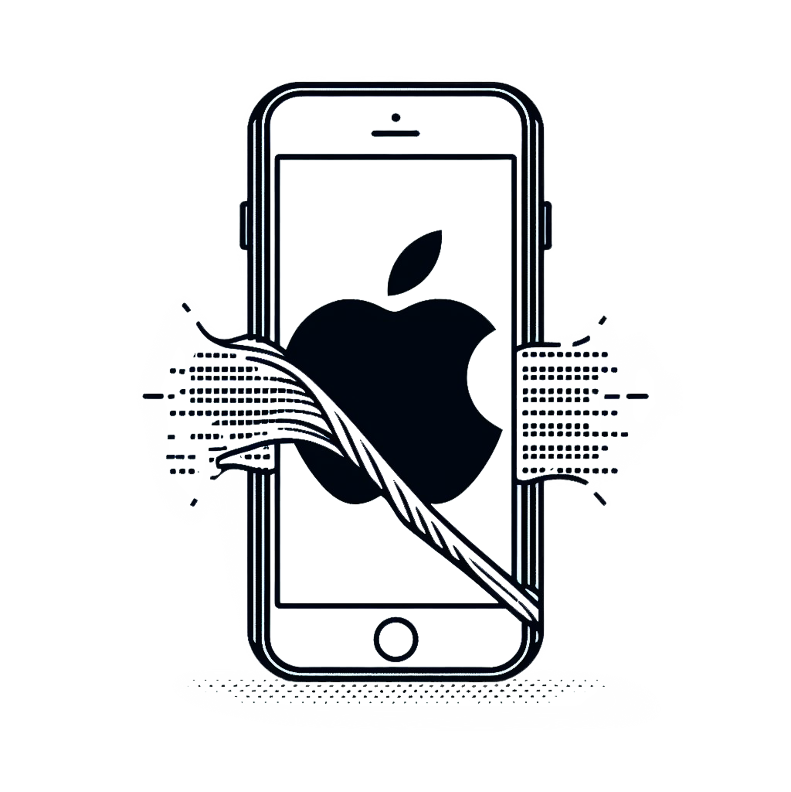

---

---

# iObfuscate: Unraveling iOS Obfuscation Techniques

During this talk, I examine multiple examples of Reverse Engineering iOS obfuscation techniques. Obfuscation strives to hide the underlying functionality of applications. This is particularly important in iOS applications that include a plethora of additional symbol data susceptible to reversing. I also release my new repository iOS Reverse Engineering repository!

# iOS Reverse Engineering Repository
The [iOS Reverse Engineering](https://github.com/LaurieWired/iOS_Reverse_Engineering) repository contains a comprehensive wiki on iOS Reverse Engineering. It also includes custom Ghidra scripts for iOS analysis, and even example IPA files demonstrating different forms of obfuscation!

## Link References
### Static Obfuscators
- Obfuscator-LLVM
  - https://github.com/obfuscator-llvm/obfuscator/tree/llvm-4.0
- Sirius Obfuscator
  - Renames variables
  - https://github.com/Polidea/SiriusObfuscator
- Obfuscator-iOS
  - https://github.com/pjebs/Obfuscator-iOS

### Open Source Runtime Protectors
- iOS Security Suite
  - https://github.com/securing/IOSSecuritySuite
- Runtime Application Self-Protection (RASP)
  - https://github.com/talsec/Free-RASP-iOS

